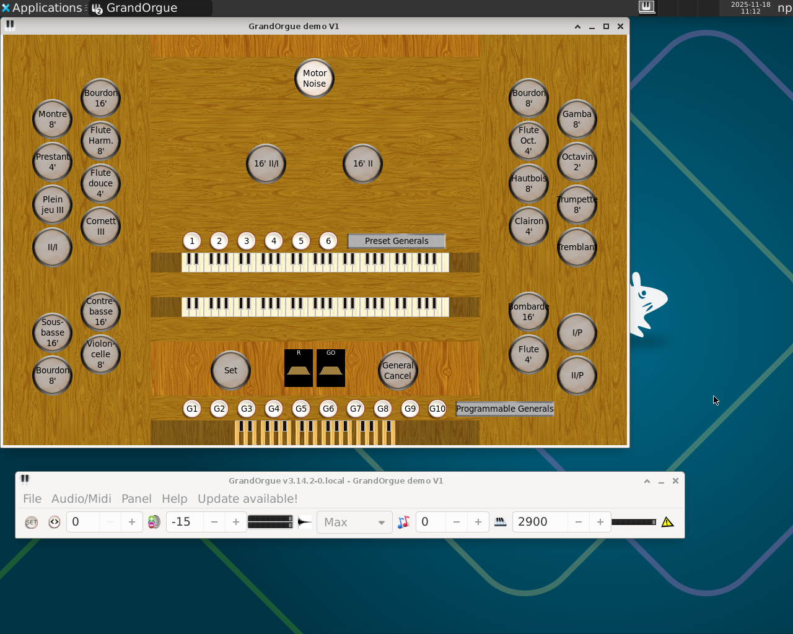

# GrandOrgue for FreeBSD

This is a port of the church-organ sample-based simulator "GrandOrgue" v3.14.2 for FreeBSD 13+. If you are running Linux, Windows or MacOS, see [the official GrandOrgue repository on Github](https://github.com/GrandOrgue).

License: GPL2 and later.

## Current status (2025/11/18): demo organ is working normally

The sound rendering part of the software and the user interface are working fine. The MIDI part is now working, using our custom version of RtMidi only.

## Hardware requirements

You will need a card to produce the sound and, if it does not support MIDI, another one to add it. The sound stack under FreeBSD, may be managed

1. either natively by the kernel: kernel modules "sound", "snd_xxx" for various cards - I suggest a SoundBlaster Live/Audigy one - "snd_uaudio" for any USB-based MIDI interface

2. and/or by OSS (Open Sound System) which brings a list of extra supported cards and provides kernel modules named "osscore", "oss_xxx" as well as user-space tools

The trick is that native kernel modules and OSS ones are not compatible. But you can use the user-space part of OSS together with the native modules. GrandOrgue generates its sound output using OSS user-space libraries.

So you cannot have, for example, a soundcard supported natively and one other for MIDI that is only supported by OSS. Your soundcard(s) must be supported either natively **OR** by OSS.

Furthermore, if your hardware is only supported by OSS, you need to recompile the FreeBSD kernel such that the module "sound" is not statically linked to the kernel. You will then be able to choose between the native sound framework (main module is "sound") and the OSS one (main module is "osscore").

Note that the large church-organs with multiple channels may require up to 128GB of RAM to work. For smallest ones with 16-bit samples, 4GB may be sufficient. Conversely, more CPU cores are better. To store these organs, you will also need some space on your hard-drive; any kind church organ may add about 5-10 GB of data for the sample set itself and the cache.

## What I'm currently using

- FreeBSD 13.5
- old server motherboard with 32GB ECC Ram, a quad-core Opteron 2379HE, and a PCIe-to-PCI adapter for the soundcard
- old dedicated 160 GB SSD
- a SoundBlaster Audigy 2 sound-card (NOTE: this card has no official MIDI support until the actual kernel is corrected, but I also have one USB to MIDI adapter)

## Software requirements

### Build system

Install the package (or the port) cmake.

### Window manager

Install your favorite one (for example fluxbox, xfce).

Also needed for the graphical stack:

- wxWidgets toolkit (package wx30-gtk3)
- ImageMagick7

### Audio subsystem

- OSS: install the package or build the port audio/oss. The modules are stored under /usr/local/lib/oss/modules if you need them.
- portaudio
- wavpack
- ZitaConvolver

### MIDI

GrandOrgue gets its MIDI input from the RtMidi library, and various sources:

	MIDI-IN ==> jack_umidi or jack_midi server ==> Jack server ==> RtMidi
	             
	MIDI-IN ==> OSS ==> RtMidi

I've not tested yet the OSS way, but the Jack path was not working for me under FreeBSD 13.5: too much latency due to the intermediary servers. 

So I made a custom version of the library RtMidi, that is embedded in this source tree and allows GrandOrgue to directly access the raw MIDI devices, for much better efficiency:

	MIDI raw device /dev/midiXXX => custom RtMidi (rtmidi-direct)

You must always install the Jack server, but it will not be used for MIDI:
- package jackit, or port audio/jack
- tool qjackctl (optional)

## How to build

In the directory storing the sources, run:

	mkdir build
	cd build
	cmake ..
	make -j4
	su root -c 'make install'

The third step will fail if you are missing one dependency. Install it and retry from this step.

## How to run it

On success, run the executable GrandOrgue from your window manager. There is a demo organ to test your config.

Before this, you must ensure the modules for your sound hardware are loaded.

For a natively supported sound or MIDI card, modules to load are "sound", "snd_xxx" and/or "snd_uaudio" (for USB-to-MIDI adapters). For a SoundBlaster Live or Audigy, it is "snd_emu10k1" while for an Audigy 2, it is "snd_emu10kx" for example.

	su root -c 'kldload sound'
	su root -c 'kldload snd_uaudio'
	su root -c 'kldload snd_emu10kx'

For OSS-supported hardware, modules are "osscore" and "oss_xxx", depending on the card.

See the man pages for sound(4), snd_uaudio(4), oss(4)..

You should add some lines

	MODULE_load="YES"

to the file /boot/loader.conf so that these modules are loaded on startup.

## Notes

### Submodules included in the tree

I've included the libraries RtAudio and RtMidi in this source tree, so that corresponding packages are not needed in the system, nor git submodules.

### Touchscreen

It is convenient to have a touch screen to toggle the stops of the organ. The module to load is "wmt".

## Author

(c) Nicolas Provost, 2025 for the changes needed to run on FreeBSD and the MIDI layer.

Original authors: see the GrandOrgue repository on github.com; you will find help there to use the software and download sample sets.

